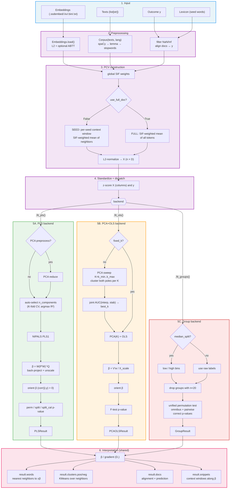

# ssdiff — Architecture

Internals of the `ssdiff` package: module layout, pipeline flow, and how the results layer composes.

For the public API see [`api_reference.md`](api_reference.md).
For the results surface see [`results.md`](results.md).

---

## Top-level pieces

```
SSD                          — driver; prepares PCVs, dispatches to backends
  ├── .fit_pls()    → PLSResult       (ContinuousResult → Result)
  ├── .fit_ols()    → PCAOLSResult    (ContinuousResult → Result)
  └── .fit_groups() → GroupResult     (Result)

Embeddings                   — word-vector store + normalization, no gensim dep
Corpus                       — spaCy tokenize/lemmatize + lexicon helpers
```

Composition, not inheritance — `SSD.__init__` only builds per-document vectors (PCVs). Each `fit_*` is a separate, explicit step and returns its own immutable result object, so multiple backends can be run on the same `SSD` instance without rebuilding doc vectors.

---

## Module layout

```
ssdiff/
├── __init__.py        — public exports
├── ssd.py             — SSD class (doc-vector construction + fit dispatchers)
├── embeddings.py      — Embeddings class (load / normalize / save / lookup)
├── corpus.py          — Corpus class (spaCy pipeline + suggest/evaluate_lexicon)
├── lang_config.py     — language → spaCy model mapping (23 languages)
├── py.typed           — PEP 561 marker
├── backends/
│   ├── pls.py         — PLS1 NIPALS, CV selection, perm / split / split_cal tests
│   ├── pca_sweep.py   — PCA + OLS; joint interpretability/stability sweep
│   ├── _sweep_math.py — sweep scoring primitives
│   └── group.py       — unified permutation test (omnibus + pairwise)
├── results/
│   ├── __init__.py       — public result exports
│   ├── core.py           — Result ABC, View / ScalarView / TestView, save()/to_* helpers, parameter-keyed cache
│   ├── schema.py         — frozen dataclasses: Word, Cluster, ClusterWord, Snippet, Doc, Pair, Suggestion, Stats, FitInfo, Summary
│   ├── continuous_result.py  — ContinuousResult, PLSResult, PCAOLSResult, and their views
│   ├── group_result.py       — GroupResult, PairsListView, GroupStatsView, GroupTestView, per-pair helpers
│   ├── paired_view.py        — ``_paired_save`` helper: unified multi-key save dispatch used by ``_ShimView``
│   ├── lexicon_result.py     — LexiconResult + lexicon views
│   ├── report.py             — Report / Section builders + text/md/html/tex/docx/json renderers
│   ├── format.py             — APA-style numeric formatting primitives (fmt_p, fmt_r, fmt_table, …)
│   └── display.py            — set_repr_hints, DEFAULT_COLS registry, DEFAULT_MAX_ROWS
└── utils/
    ├── math.py         — standardize, PCA, KMeans, f_sf / t_sf / chi2_sf (pure numpy)
    ├── text.py         — spaCy wrappers, PreprocessedDoc dataclass
    ├── vectors.py      — SIF-weighted doc-vector construction
    ├── neighbors.py    — filtered nearest-neighbor lookup + cluster_top_neighbors
    ├── snippets.py     — snippets_along_beta (context-window extraction)
    ├── lexicon.py      — suggest_lexicon, coverage_by_lexicon
    └── diagnostics.py  — progress_hook, runtime counters
```

Core runtime deps: **numpy + spaCy**. Gensim is optional (only to write `.kv`; loading `.kv` works via an internal unpickler shim). Matplotlib / pandas / openpyxl / python-docx are behind the `[results]` extra and gated at call sites.

---

## Pipeline flow

### Construction

```
Embeddings + Corpus + y + lexicon
        │
        ▼
   SSD.__init__()
        │
        ├─ build_and_normalize_doc_vectors()   # SIF-weighted averages near seeds
        │    ├─ compute global SIF weights (word_freq / total_tokens)
        │    ├─ seed mode: per-doc = mean of SIF-weighted context-window vectors
        │    │   (full-doc mode when use_full_doc=True: SIF over all tokens)
        │    └─ L2-normalize rows → x  (n × D)
        ├─ standardize y (kept raw; backends standardize internally)
        └─ store: x, y, _keep_mask, lexicon, window, sif_a, lang
```

No fitting runs at construction — just doc-vector preparation.

### `fit_pls()`

```
ssd.x (n × D), ssd.y (n)
        │
        ├─ standardize X  (columns, ddof=0)
        ├─ optional PCA preprocess  (var95 or fixed k) → Z
        ├─ optional auto-select n_components  (K-fold CV, argmax R²)
        ├─ NIPALS PLS1:
        │    for each component:
        │      w = X'y / ‖X'y‖
        │      t = Xw           (score)
        │      p = X't / t't    (loading)
        │      q = y't / t't    (y-loading)
        │      deflate X and y
        ├─ β = W (P'W)⁻¹ Q
        ├─ back-project through PCA preprocess (if any)  →  β in embedding space
        ├─ unscale: β / X_scale
        ├─ orient β: flip if corr(ŷ, y) < 0
        └─ p-value (optional):
             "perm"       → full permutation on CV-R²
             "split"      → repeated train/test split, overlap-corrected t
             "split_cal"  → split procedure on permuted y → exact null
             "auto"       → "split" for n_components=1, "perm" otherwise
                                │
                                ▼
                          PLSResult
```

### `fit_ols()`

```
ssd.x (n × D), ssd.y (n)
        │
        ├─ standardize X  (columns, ddof=0)
        ├─ if fixed_k given → PCA(K) + OLS; else:
        │    PCA sweep K=k_min..k_max, step=k_step
        │    for each K:
        │      PCA(K) → Z → OLS → β
        │      cluster both β-poles → coherence
        │      track stability as 1 − cos(β, β_prev)
        │    score each K:
        │      interp = detrend coherence by var%
        │      stab   = −Δβ
        │      joint  = 0.5 · (AUC_interp + AUC_stab)
        │    → best_k
        ├─ β = V_K w_K / X_scale    (back-project)
        ├─ orient β: flip if corr(ŷ, y) < 0
        └─ F-test p-value
                │
                ▼
         PCAOLSResult
```

### `fit_groups()`

```
ssd.x (n × D), ssd.y (group labels or continuous if median_split=True)
        │
        ├─ (optional) median-split y into "low" / "high"
        ├─ filter_small_groups (n < 20 dropped with warning)
        ├─ backends.group.unified_permutation_test:
        │    observed omnibus T = mean pairwise cosine distance between group centroids
        │    for each permutation: shuffle labels, recompute T → null
        │    pairwise: per-contrast T, p_raw, Cohen's d, contrast_norm
        │    correct pairwise p-values (holm / bonferroni / fdr_bh / none)
        └─ build per-contrast sub-view rows:
             words  = nearest neighbors to ±β̂_pair
             clusters, cluster_words = KMeans over neighbors
             snippets = SIF-scored context windows along ±β̂_pair
                │
                ▼
          GroupResult  (keeps x, groups around for gr.test() reruns)
```

---

## Results layer

The results layer is a small set of composable primitives in `results/core.py`, extended by the four concrete result modules.

### `Result` (ABC, in `core.py`)

```python
class Result:
    corpus: Corpus | None
    embeddings: Embeddings | None
    _cache: dict[(str, tuple), View]      # parameter-keyed
    _access: tuple[str, ...]              # repr discoverability — views / methods
    _arrays: tuple[str, ...]              # repr discoverability — numpy arrays

    def attach(corpus=None, embeddings=None) -> Self
    def clear_cache(view: str | None = None) -> None
    def _cache_get(name, params, compute) -> View
    def _require_resource(resource, view_name) -> None   # raises with fix hint
    def __repr__(self) / _repr_html_(self)               # summary + access hint + save hint
```

`_access` entries with `(...)` render as methods; bare names render as views. Prefixing every entry with `.` turns the repr into a copy-paste prompt (`result.clusters`, `result.test(...)`).

### `View[T]`, `ScalarView`, `TestView` (in `core.py`)

Every view is a thin iterable over frozen dataclasses that gains a uniform export surface by inheritance:

```
View[T]                  — tabular; __iter__ yields T (a dataclass)
 ├─ ScalarView          — single-row; attribute + __getitem__ access to fields
 │   └─ TestView        — callable; reruns a statistical test, mutates parent
 └─ …                   — WordsView, DocsView, SnippetsView, SidedClustersView, …
```

Uniform methods defined on `View` / `ScalarView`:

| Method | What it does |
|---|---|
| `to_dict`, `to_records`, `to_df`, `to_html`, `to_text` | in-memory export; `cols=None\|"all"\|sequence` |
| `save(path, *, cols=None, k=None)` | disk export; extension dispatch |
| `_resized(k)` | trim to first k rows (default: slicing) |
| `_save_hint()` / `_save_hint_html()` | one-line repr footer |
| `_default_cols()` | per-class default column subset (looked up via `DEFAULT_COLS`) |

`TestView.__call__(name=None, **params)` dispatches to a subclass-implemented `_run(name, params)`, updates `self._info`, and runs an `_on_rerun()` hook so the parent's `stats.pvalue` stays in sync with `test.pvalue`.

### Parameter-keyed cache

Views computed from parameters live in `Result._cache` keyed by `(view_name, frozen_params)` where `frozen_params = tuple(sorted(params.items()))`. Each distinct parameter set gets its own entry:

```python
result.clusters.pos                # cache key ("clusters", (("side", "pos"), ("topn", 100), …))
result.clusters.pos(topn=50)       # cache key ("clusters", (("side", "pos"), ("topn", 50),  …))
result.clusters.pos                # still hits the topn=100 entry
```

`clear_cache()` drops the whole dict; `clear_cache("clusters")` drops every entry whose first key matches. There is no by-params form by design — users who need that should call the view with the specific params they want to rebuild.

### Column defaults (`results/display.py`)

A single registry maps view **class names** (not `_name`s) to their default column subset:

```python
DEFAULT_COLS: dict[str, tuple[str, ...]] = {
    "WordsView":          ("side", "rank", "word", "cos_beta"),
    "SnippetsView":       ("side", "doc_id", "cosine", "seed", "text_window"),
    "StatsView":          ("backend", "r2", "pvalue", "n_kept", "iqr_effect"),
    "OLSStatsView":       ("backend", "r2", "r2_adj", "pvalue", "n_kept", "iqr_effect"),
    …
}
```

Keying by `__name__` (not `_name`) lets sibling views with the same `_name` — e.g. `StatsView` vs `OLSStatsView` — diverge. Views without an entry fall through to full `_columns` via `View._default_cols()`.

`_validate_cols(cols, view)` in `core.py` resolves `cols=` on every output call: `None → _default_cols()`, `"all" → _columns`, explicit sequence → validated (unknown names warn, dropped).

### Numeric formatting (`results/format.py`)

APA-style primitives used by every renderer:

| helper | behavior |
|---|---|
| `fmt_p(x)` | `<.001` / three decimals (`.007`) — never scientific |
| `fmt_r(x, signed=False)` | two-decimal correlation-scale number |
| `fmt_d(x)` | three-decimal effect size |
| `fmt_pct(x)` | percentage |
| `fmt_count(x)` | thousands-separated integer |
| `fmt_cell(v, col)` | dispatch on column name + value type |
| `fmt_table(rows, headers, numeric, …)` | aligned plain-text table (used by every `to_text`) |

Consistent formatting means repr, `to_text`, `to_html`, markdown, and LaTeX outputs all show p-values as `.007` (never `7.3e-03`) and correlations to two decimals.

### Report builder (`results/report.py`)

A `Report` is a multi-section builder (title + optional subtitle + list of `Section`s). Three `Section.kind`s:

| kind | row shape | rendered as |
|---|---|---|
| `"kv"` | `list[(key, value)]` | 2-col table (terminal), `<table class="kv">` (HTML), `| Metric | Value |` (MD), `\begin{tabular}{ll}` (TeX) |
| `"table"` | `list[list]` + headers | multi-col table in every format |
| `"list"` | `list[str]` | bullet list |

`Report.save(path)` dispatches on extension: `.md .txt .html .tex .docx .json`. The Plisiecki et al. (2025) citation appends unless `cite=False`.

---

## Pipeline flow diagram



---

## Significance testing

### `fit_ols()` — F-test

Analytic F-test from OLS in PCA space. Tests the null that all PCA-space regression coefficients are zero. Cheap, always computed, returned as `result.stats.pvalue` and echoed on `result.test`.

### `fit_pls()` — three options

| name | idea | cost | control |
|---|---|---|---|
| `"perm"` | shuffle y, refit PLS with CV, compare observed CV-R² to null | `n_perm` PLS refits | exact under permutation |
| `"split"` | repeated train/test split, correlate predictions, overlap-corrected t | `n_splits` PLS fits | asymptotic |
| `"split_cal"` | run the full split procedure on permuted y → exact null | `n_splits × n_perm` PLS fits | exact |
| `"auto"` | `"split"` for `n_components=1`, `"perm"` otherwise | — | — |

All three are exposed as `result.test(name, **params)` for reruns; `result.stats.pvalue` is propagated by the `_on_rerun` hook.

### `fit_groups()` — permutation omnibus + pairwise

Observed omnibus statistic: mean pairwise cosine distance between group centroids. Null: shuffle group labels `n_perm` times. Pairwise contrasts get their own permutation p-values with multiple-comparison correction (Holm, Bonferroni, FDR-BH, or none).

---

## Pure-numpy math (`utils/math.py`)

`ssdiff` avoids scipy/scikit-learn at runtime. Primitives implemented from scratch:

- `standardize(X)` — z-score with `ddof=0` (matches sklearn's `StandardScaler`).
- `pca(X, k)` — SVD-based PCA returning components + explained variance.
- `kmeans(X, k)` — used for cluster_top_neighbors.
- `f_sf / t_sf / chi2_sf` — survival functions for analytic tests.

This keeps the wheel slim and avoids version pinning for transitive scipy / sklearn dependencies in the SSD_APP GUI build.

---

## See also

- [`api_reference.md`](api_reference.md) — user-facing API.
- [`results.md`](results.md) — results surface (views, reports, cache, reruns).
- [`results_tables.md`](results_tables.md) — per-view column listings and defaults.
