# Architecture Comparison: `ssdiff` v1.0 vs Official `ssdiff` v0.2

Side-by-side comparison of the two implementations of the Supervised Semantic Differential method.

---

## Overview

| | **Official `ssdiff` v0.2** | **`ssdiff` v1.0 (this package)** |
|--|--|--|
| PyPI | `ssdiff` (v0.2.2) | `ssdiff` (v1.0.0) |
| Design | Monolithic, base-class inheritance | Modular, composition + strategy pattern |
| Regression | PCA+OLS only (fits in `__init__`) | PLS (default) or PCA+OLS (deferred `fit_*()`) |
| Results | Attributes on SSD instance | Separate result classes (`PLSResult`, `PCAOLSResult`) |
| Embeddings | Gensim `KeyedVectors` | Custom `Embeddings` class (gensim optional) |
| Text processing | Utility functions | `Corpus` class |
| Core deps | numpy, pandas, scikit-learn, gensim, spacy | numpy, spacy, matplotlib |
| Optional deps | requests, matplotlib | gensim (saving .kv only) |

---

## Class Hierarchy

### Official `ssdiff` v0.2

```
_SSDBase (abstract)
  ├── SSD            → fits OLS in __init__, result attrs on self
  └── SSDGroup       → permutation tests in __init__
        └── .get_contrast() → SSDContrast (duck-types with SSD)
```

`_SSDBase._build_pcvs()` is a monolithic method that runs the full pipeline in sequence:
1. Load embeddings (KeyedVectors or path string)
2. Filter NaN y / invalid groups
3. Build SIF-weighted document vectors
4. L2-normalize
5. `StandardScaler.fit_transform()`
6. `PCA.fit_transform()`

Both `SSD` and `SSDGroup` inherit this pipeline. SSD then immediately runs OLS regression and sets `self.beta`, `self.r2`, etc.

### `ssdiff` v1.0 (this package)

```
SSD                          → builds doc vectors in __init__, defers fitting
  ├── .fit_pls()    → PLSResult (ContinuousResult → Result)
  ├── .fit_ols()    → PCAOLSResult (ContinuousResult → Result)
  └── .fit_groups() → GroupResult (Result)

Embeddings                   → standalone, no Gensim dependency
Corpus                       → standalone, wraps spaCy + suggest_lexicon()
```

Key differences:
- **Unified SSD class** — one class for continuous and group analysis
- **Deferred fitting** — `SSD.__init__()` prepares data; `fit_pls()`, `fit_ols()`, or `fit_groups()` runs the analysis
- **Result objects** — fitting returns `PLSResult`, `PCAOLSResult`, or `GroupResult` with shared view / export / report API via the `Result` base class
- **First-class input wrappers** — `Embeddings` and `Corpus` are proper classes, not utility functions

---

## Pipeline Flow

### Official `ssdiff` v0.2

```
KeyedVectors + list[list[str]] + y
        │
        ▼
   SSD.__init__()
        │
        ├─ _build_pcvs()  [inherited from _SSDBase]
        │     ├─ load_embeddings(path_or_kv)
        │     ├─ build_doc_vectors() → X
        │     ├─ L2-normalize X
        │     ├─ StandardScaler → Xs
        │     └─ PCA(N_PCA) → z
        │
        ├─ OLS: w = solve(z'z, z'ys)
        ├─ beta = pca.components_.T @ w / scaler.scale_
        ├─ r2, r2_adj, f_stat, f_pvalue
        └─ calibrate effect sizes
        │
        ▼
   ssd.beta, ssd.r2, ssd.top_words(), ...
```

Everything happens in the constructor. There is one pipeline, one backend, one result.

### `ssdiff` v1.0

```
Embeddings + Corpus + y
        │
        ▼
   SSD.__init__()
        │
        ├─ build_and_normalize_doc_vectors() → X, keep_mask
        ├─ standardize y
        └─ store: x, y_kept, keep_mask
        │
        ├───────────────┬──────────────────┐
        ▼               ▼                  │
   fit_pls()       fit_ols()              │
        │               │                  │
        ├─ standardize X├─ standardize X    (numerically equivalent; both use ddof=0)  │
        ├─ [PCA preproc]├─ PCA (SVD)       │
        ├─ PLS1 NIPALS  ├─ OLS             │
        ├─ p-value test ├─ F-test          │
        └─ → PLSResult  └─ → PCAOLSResult  │
              │                │            │
              └───────┬────────┘            │
                      ▼                     │
              Shared API:                   │
              .stats, .words,               │
              .clusters.pos/neg,            │
              .docs, .snippets, .report()   │
```

Construction prepares data. Fitting is a separate, explicit step. Multiple backends can be used on the same `SSD` instance.

---

## Key Architectural Differences

### 1. Fitting Strategy

**`ssdiff`**: OLS runs inside `__init__`. The SSD instance *is* the result — `ssd.r2`, `ssd.beta`, `ssd.top_words()` all live on the same object. There is no way to try a different backend without creating a new instance.

**`ssdiff`**: `__init__` only prepares document vectors. You call `ssd.fit_pls()` or `ssd.fit_ols()` explicitly, and each returns a separate result object. You can fit both backends on the same data for comparison without rebuilding doc vectors.

### 2. Backend Options

**`ssdiff`**: PCA(N_PCA) → OLS. Always. N_PCA is fixed at construction (default 20).

**`ssdiff`**: Two backends:
- **PLS** (default): Pure-numpy NIPALS PLS1. Supports cross-validated component selection, three significance tests (permutation, split-half, permutation-calibrated split-half), and optional PCA preprocessing.
- **PCA+OLS**: Matches official algorithm exactly (standardize + PCA + normal equations, all pure numpy). Supports auto-sweep for optimal K.

### 3. Embedding Handling

**`ssdiff`**: Requires Gensim `KeyedVectors`. Accepts either a pre-loaded KV object or a file path. Normalization via utility function `normalize_kv()`.

```python
from gensim.models import KeyedVectors
kv = KeyedVectors.load_word2vec_format("model.bin")
ssd = SSD(kv, docs, y, lexicon)
# or
ssd = SSD("model.bin", docs, y, lexicon)  # loads internally
```

**`ssdiff`**: Custom `Embeddings` class. Gensim is optional (only needed for `.kv` format). Normalization is a method on the object.

```python
emb = Embeddings.load("model.ssdembed")  # or .bin, .txt, .vec, .kv
emb.normalize(l2=True, abtt_m=1)
ssd = SSD(emb, corpus, y, lexicon)
```

### 4. Text Processing

**`ssdiff`**: Utility functions (`load_spacy()`, `preprocess_texts()`, `build_docs_from_preprocessed()`). User must call them manually and pass `list[list[str]]` to SSD.

```python
nlp = load_spacy("pl_core_news_lg")
stopwords = load_stopwords("pl")
pre_docs = preprocess_texts(texts, nlp, stopwords)
docs = build_docs_from_preprocessed(pre_docs)
ssd = SSD(kv, docs, y, lexicon)
```

**`ssdiff`**: `Corpus` class encapsulates the full preprocessing pipeline.

```python
corpus = Corpus(texts, lang="pl")  # handles spaCy loading, tokenization, lemmatization
ssd = SSD(emb, corpus, y, lexicon)
```

### 5. Result Representation

**`ssdiff`**: All results are attributes on the SSD instance itself.

```python
ssd = SSD(kv, docs, y, lexicon)
ssd.r2          # float
ssd.beta        # ndarray
ssd.f_pvalue    # float
ssd.top_words() # pd.DataFrame (requires pandas)
```

**`ssdiff`**: Results are separate objects with a shared base class and view-based API.

```python
ssd = SSD(emb, corpus, y, lexicon)
result = ssd.fit_pls()
result.stats.r2         # float
result.stats.pvalue     # float
list(result.words)[:20] # list[Word] dataclasses (no pandas needed)
result.clusters.pos     # SidedClustersView
result.report().save("report.md")
```

### 6. Significance Testing

**`ssdiff`**: F-test p-value from OLS regression (`scipy.stats.f.cdf`). This tests the null that *all PCA-space regression coefficients are zero* — not a direct test of the semantic dimension's meaningfulness.

**`ssdiff`**: Both backends include significance testing:

**PCA+OLS** (`fit_ols()`): F-test p-value (same null hypothesis as `ssdiff` — all PCA-space regression coefficients are zero). Always computed.

**PLS** (`fit_pls()`): Three purpose-built significance tests for the SSD context:
- **Permutation test** (`"perm"`): Shuffles y, refits PLS with CV, compares observed CV-R² to null distribution.
- **Split-half test** (`"split"`): Splits data into train/test halves repeatedly, correlates predictions, applies overlap-corrected t-test.
- **Calibrated split-half** (`"split_cal"`): Builds an exact null distribution by running the full split procedure on permuted y. Exact FPR control.

### 7. Dependency Model

**`ssdiff`**: All dependencies required at install time.
- numpy, pandas, scikit-learn, gensim, spacy, requests, matplotlib

**`ssdiff`**: Minimal core.
- **Required**: numpy, spacy, matplotlib
- **Optional**: gensim (only for saving `.kv` format; loading `.kv` works without gensim via an internal unpickler shim)

### 8. Output Format

**`ssdiff`**: Returns pandas DataFrames from `top_words()`, `results_table()`. Requires pandas as a dependency.

**`ssdiff`**: Returns `list[dict]` from all methods. No pandas dependency. Easy to convert to DataFrame if needed:

```python
import pandas as pd
df = pd.DataFrame(result.top_words(20))
```

---

## Constructor Parameters

### SSD (continuous outcomes)

| Parameter | `ssdiff` | `ssdiff` | Notes |
|-----------|----------|-----------|-------|
| embeddings | `kv: KeyedVectors \| str` | `embeddings: Embeddings` | ssdiff accepts path strings |
| texts | `docs: list[list[str]]` | `corpus: Corpus` | ssdiff wraps preprocessing |
| outcome | `y: ndarray` | `y: array-like` | Same |
| lexicon | `lexicon` | `lexicon: Sequence \| set` | Same |
| PCA components | `N_PCA: int = 20` | — | ssdiff: set in `fit_ols()` |
| L2 normalize | `l2_normalize_docs: bool = True` | — | ssdiff: always normalizes |
| unit beta | `use_unit_beta: bool = True` | — | ssdiff: always unit-normalizes beta |
| window | `window: int = 3` | `window: int = 3` | Same |
| SIF param | `sif_a: float = 1e-3` | `sif_a: float = 1e-3` | Same |
| full doc | `use_full_doc: bool = False` | `use_full_doc: bool = False` | Same |

### Group Analysis (categorical)

| Parameter | `ssdiff` | `ssdiff` | Notes |
|-----------|----------|-----------|-------|
| class | `SSDGroup` (standalone) | `SSD.fit_groups()` | Unified into SSD |
| groups | `groups: Sequence` (constructor) | `y` (SSD constructor) | y serves as group labels |
| median split | N/A | `median_split: bool = False` | New in ssdiff |
| permutations | `n_perm: int = 5000` | `n_perm: int = 5000` | Same |
| p-correction | Bonferroni only | `correction: str = "holm"` | Holm/Bonf/FDR-BH/none |
| random state | `random_state: int = 42` | `random_state: int = 2137` | |
| min group size | N/A | 20 docs (auto-drop with warning) | New in ssdiff |
| result type | `SSDGroup` + `SSDContrast` | `GroupResult` | Unified result |

---

## Module Structure

### Official `ssdiff` v0.2

```
ssdiff/
├── __init__.py        # Exports all public API
├── core.py            # _SSDBase, SSD
├── crossgroup.py      # SSDGroup, SSDContrast
├── clusters.py        # cluster_top_neighbors
├── snippets.py        # Snippet extraction
├── utils.py           # load_embeddings, normalize_kv, build_doc_vectors, filtered_neighbors
├── preprocess.py      # load_spacy, load_stopwords, preprocess_texts
├── lexicon.py         # suggest_lexicon, coverage_by_lexicon
├── io_utils.py        # File I/O helpers
└── sweep.py           # PCA parameter sweep
```

### `ssdiff` v1.0

```
ssdiff/
├── __init__.py        # Exports: Embeddings, Corpus, SSD, result classes
├── embeddings.py      # Embeddings class (load/normalize/save/lookup)
├── corpus.py          # Corpus class (spaCy tokenization + suggest_lexicon/evaluate_lexicon)
├── ssd.py             # SSD class (doc vectors + fit_pls/fit_ols/fit_groups)
├── lang_config.py     # Language → spaCy model mapping
├── backends/
│   ├── pls.py         # PLS1 NIPALS, CV, permutation/split tests
│   ├── pca_sweep.py   # PCA+OLS sweep
│   └── group.py       # Group permutation tests (fit_groups backend)
├── results/
│   ├── __init__.py    # Public exports: Result, PLSResult, PCAOLSResult, GroupResult, PairView, LexiconResult
│   ├── base.py        # Result ABC, View/ScalarView contract, param-keyed cache
│   ├── schema.py      # Frozen domain dataclasses (Word, Cluster, Snippet, Doc, Pair, Suggestion, …)
│   ├── format.py      # APA-inspired formatting primitives
│   ├── report.py      # Report builder + text/md/html/docx renderers
│   ├── ssd.py         # ContinuousResult, PLSResult, PCAOLSResult
│   ├── group.py       # GroupResult, PairView
│   └── lexicon.py     # LexiconResult
└── utils/
    ├── math.py        # standardize, PCA, KMeans, f_sf, t_sf, chi2_sf
    ├── text.py        # spaCy wrappers, PreprocessedDoc
    ├── vectors.py     # SIF doc vector construction
    ├── neighbors.py   # Filtered neighbors, clustering
    ├── snippets.py    # Snippet extraction
    └── lexicon.py     # Lexicon suggestion, coverage
```

#### Results layer architecture

The results layer uses a **View / ScalarView / Result** pattern:

- `Result` (in `base.py`) is an abstract base class providing `.stats`, `.report()`, `.save()`, `.load()`, and `.clear_cache()`. It holds no mutable state after construction.
- Views (`WordsView`, `ClustersIndex`, `SnippetsView`, `DocsView`, etc.) are lazy, cacheable, iterable objects that expose domain dataclasses. They implement a uniform contract: `len`, `iter`, `__getitem__`, `.where(...)`, `.df()`, `.to_dict()`, `.to_csv()`, etc. Parameter-keyed views (clusters, snippets) are cached on first access and can be recomputed with `.recompute(**params)`.
- `ScalarView` handles `.stats` — a dict-like bag of scalar metrics with attribute access.
- Domain objects (`Word`, `Cluster`, `Snippet`, `Doc`, `Pair`, `Suggestion`) are frozen dataclasses defined in `schema.py`.

All three result types (`ContinuousResult`, `GroupResult`, `LexiconResult`) share the same view / export / report machinery. See [`results.md`](results.md) for the full user-facing surface.

Key structural differences from v0.2:
- **`ssdiff` separates backends** into their own subpackage (`backends/`)
- **`ssdiff` results are a package** (`results/`) — eight focused files vs a single 1,260-line monolith
- **`ssdiff` has first-class input classes** (`embeddings.py`, `corpus.py`) instead of utility functions
- **`ssdiff` implements math internally** (`utils/math.py`) — pure numpy, no scipy dependency

---

## Numerical Equivalence

When `ssdiff` uses `fit_ols()`, the pipeline matches the official `ssdiff` algorithm exactly:
- Same standardize + PCA (SVD) + normal equations
- Same beta back-projection: `components.T @ w / X_scale`
- Same orientation logic (beta flipped to correlate positively with y)

The `fit_pls()` backend is a different algorithm (NIPALS PLS1 vs PCA+OLS) and produces different results by design.

---

## Summary

`ssdiff` v1.0 is a ground-up rewrite that keeps the same core idea (SIF doc vectors → regression → interpret beta as a semantic dimension) but changes *how* the code is organized:

1. **Composition over inheritance** — no shared base class, explicit fit calls
2. **Multiple backends** — PLS (new, default) alongside PCA+OLS (matches official)
3. **Proper input abstractions** — `Embeddings` and `Corpus` classes
4. **Separate result objects** — clean separation of data prep, fitting, and interpretation
5. **Minimal dependencies** — numpy, spacy, matplotlib (no scikit-learn, no pandas)
6. **Purpose-built significance tests** — permutation, split-half, calibrated split-half

---

## Pipeline Flow Diagram

```mermaid
flowchart TD
    %% ── 1. INPUT ───────────────────────────────────────
    subgraph INPUT["1. Input"]
        direction LR
        texts["Texts\n(list[str])"]
        y["Outcome y\n(numeric array)"]
        emb["Embeddings\n(.ssdembed/.kv/.bin/.txt)"]
        lex["Lexicon\n(seed words)"]
    end

    %% ── 2. PREPROCESSING ──────────────────────────────
    subgraph PREPROCESS["2. Preprocessing"]
        direction LR
        load_emb["Embeddings.load()\nL2 normalize\noptional ABTT denoising"]
        corpus["Corpus(texts, lang)\nspaCy tokenize\n→ lemmatize\n→ remove stopwords"]
        filter["Filter NaN/Inf\nalign docs ↔ y\npass lexicon through"]
    end

    texts --> corpus
    emb --> load_emb
    y --> filter
    lex --> filter

    %% ── 3. DOC VECTORS ────────────────────────────────
    subgraph DOCVEC["3. Document Vector Construction (shared)"]
        sif["Compute global SIF weights\nword_freq / total_tokens"]
        sif --> mode{"use_full_doc?"}
        mode -- "False (default)" --> seed_mode["SEED mode\nFor each doc: find lexicon hits →\nextract context window →\nSIF-weighted avg of context embeddings →\nmean of all occurrences"]
        mode -- "True" --> full_mode["FULL mode\nSIF-weighted average of\nALL token embeddings"]
        seed_mode --> l2["L2-normalize rows → X (n × D)"]
        full_mode --> l2
    end

    load_emb --> sif
    corpus --> sif
    filter --> sif

    %% ── 4. STANDARDIZE + SPLIT ─────────────────────────
    subgraph STD["4. Standardize & Split"]
        std_xy["Z-score X (columns) and y"]
        std_xy --> split{{"Choose backend"}}
    end

    l2 --> std_xy

    %% ── 5A. PLS ────────────────────────────────────────
    subgraph PLS["5A. PLS Backend"]
        pca_pre{"PCA preprocess?"}
        pca_pre -- "Yes" --> pca_reduce["PCA reduction\n(var95 or fixed k)\nXs → Z (n × k)"]
        pca_pre -- "No" --> cv_select
        pca_reduce --> cv_select["Auto-select n_components\n10-fold CV, k=1..15\n1-SE rule → best_k"]
        cv_select --> nipals["NIPALS PLS1\nFor each component:\n  w = X'y / ‖X'y‖\n  t = Xw  (score)\n  p = X't/t't  (loading)\n  q = y't/t't  (y-loading)\n  deflate X and y"]
        nipals --> pls_coef["β = W(P'W)⁻¹Q\nback-project if PCA used\nunscale: β / X_scale"]
        pls_coef --> pls_orient["Orient β\ncorr(ŷ,y) < 0 → flip"]
        pls_orient --> pls_perm["Permutation test (opt.)\n1000× shuffle y\n→ null CV-R² → p_perm"]
        pls_perm --> pls_stats["R², R²_adj, F p-value"]
    end

    split -- ".fit_pls()" --> pca_pre

    %% ── 5B. PCA/OLS ───────────────────────────────────
    subgraph PCAOLS["5B. PCA/OLS Backend"]
        sweep{"fixed_k given?"}
        sweep -- "No (auto)" --> pca_sweep["PCA Sweep k=2,4,...,120\nFor each K:\n  PCA(K) → Z → OLS → β\n  Cluster both poles\n  → coherence + cos(β)\n  Track stability Δ(β)"]
        pca_sweep --> score_k["Score each K\ninterp = detrend coherence by var%\nstab = −Δ(β)\njoint = 0.5×(AUCK_interp + AUCK_stab)\n→ best_k"]
        score_k --> final_pca
        sweep -- "Yes (fixed)" --> final_pca["PCA(best_k) + OLS\nw = (Z'Z)⁻¹Z'y"]
        final_pca --> backproj["Back-project\nβ = V'w / X_scale"]
        backproj --> ols_orient["Orient β\ncorr(ŷ,y) < 0 → flip"]
        ols_orient --> ols_stats["R², R²_adj, F p-value"]
    end

    split -- ".fit_ols()" --> sweep

    %% ── 6. RESULTS ─────────────────────────────────────
    subgraph RESULT["6. Interpretation (shared)"]
        beta["β vector (D,)\nSemantic dimension in embedding space"]
        beta --> topw["result.words\nNearest neighbors to ±β̂\n→ pos & neg poles"]
        beta --> cluster["result.clusters.pos/neg\nK-means on top neighbors\nauto-k via silhouette\n→ thematic clusters"]
        beta --> effects["result.docs\ncosine alignment per doc\nΔy per +0.10 cos"]
        beta --> snip["result.snippets\nSentences scored by\nalignment to β̂"]
    end

    pls_stats --> beta
    ols_stats --> beta

    %% ── STYLING ────────────────────────────────────────
    classDef input fill:#e8f4f8,stroke:#2196F3,stroke-width:2px
    classDef shared fill:#f3e5f5,stroke:#9C27B0,stroke-width:2px
    classDef pls fill:#e8f5e9,stroke:#4CAF50,stroke-width:2px
    classDef pcaols fill:#fff3e0,stroke:#FF9800,stroke-width:2px
    classDef result fill:#fce4ec,stroke:#E91E63,stroke-width:2px

    class INPUT input
    class PREPROCESS,DOCVEC,STD shared
    class PLS pls
    class PCAOLS pcaols
    class RESULT result
```



### Diagram Legend

| Color | Phase |
|-------|-------|
| Blue | Input data |
| Purple | Shared preprocessing (both backends) |
| Green | PLS backend path |
| Orange | PCA/OLS backend path |
| Pink | Shared interpretation output |

### Key Differences

| Aspect | PLS | PCA/OLS |
|--------|-----|---------|
| **Dimensionality** | No mandatory reduction (optional PCA preprocess) | Mandatory PCA sweep |
| **Fitting** | Iterative NIPALS: extracts latent components sequentially, deflating X and y | Two-step: PCA projection → closed-form OLS |
| **Component selection** | 10-fold CV on residual R², 1-SE parsimony rule | Grid search scoring interpretability (cluster coherence) + stability (Δβ) |
| **Significance** | Permutation test on CV-R² (null distribution) | F-test from OLS regression |
| **Output** | Same β vector, same interpretation API | Same β vector, same interpretation API |
